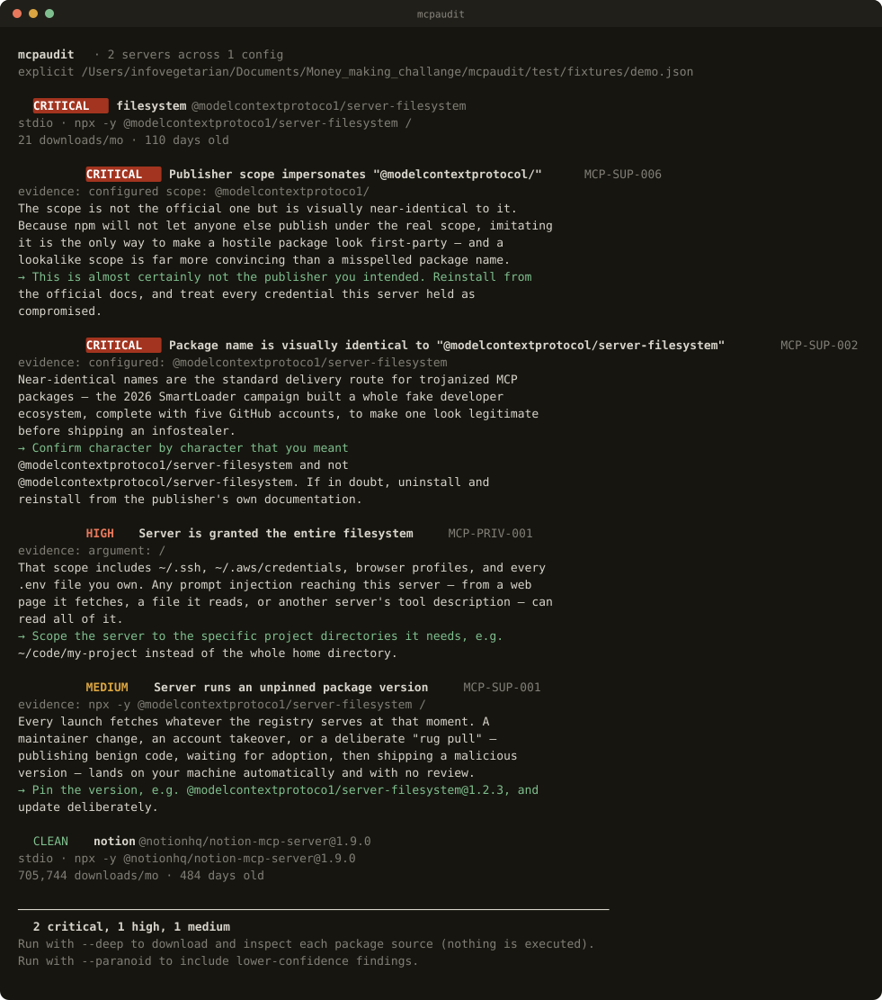

# mcpaudit

**Audit your MCP servers before they audit you.**

Every MCP server you install runs on your machine with the credentials you hand it. Most people have five or six of them and have never read a line of any of their source. This tool reads them for you.

Zero dependencies. Nothing is installed, nothing is executed.

```bash
npx github:AndrewXuTurtle/mcpaudit
```



---

## It found a live typosquat on day one

While testing the scanner I invented a plausible-looking fake package name to use as a fixture. It turned out to be real, and it is on npm right now:

```
@modelcontextprotoco1/server-filesystem     ← digit 1, not letter l
@modelcontextprotocol/server-filesystem     ← the official package
```

The impersonation is **byte-identical to official release 2026.1.14**. Every file in `dist/` has the same SHA-256 as the real thing. The only difference in the entire package is one character in its name:

```diff
- "name": "@modelcontextprotocol/server-filesystem"
+ "name": "@modelcontextprotoco1/server-filesystem"
```

It also ships forged provenance — `"author": "Anthropic, PBC"`, `homepage: modelcontextprotocol.io`, and a `repository` field pointing at the official GitHub repo. Published 2026-04-13 by npm user `eliav.livneh`. It does not appear in npm search results.

**There is no malicious code in it today.** That is the point. This is the setup phase of a rug pull: publish something clean and identical, wait for installs to accumulate, then ship a payload in a later version — which every `npx` user and every unpinned config picks up automatically, with no review.

A content scanner cannot catch this. There is nothing bad in the content; the content *is* the official code. Only provenance catches it. `mcpaudit` flags it `CRITICAL` before you run it.

I probed 790 homoglyph variants of the official scope and found exactly one live impersonation. One is enough.

**This was an independent rediscovery, not a first report.** Microsoft Defender already ships a
signature that matches `@modelcontextprotoco1` inside MCP config files, and
[mcpshield](https://github.com/mcpshield/mcpshield) already lists it. I found it on my own, but I
did not find it first, and the corroboration matters more than the credit — Microsoft detecting on
the *identifier in your config* rather than on anything in the payload is precisely the argument
above. There is nothing in the bytes to find.

---

## Why another scanner

Independent testing put YARA-style MCP scanners at roughly a **78% false-positive rate**. A tool that is wrong four times in five gets uninstalled in a week, and then you have no scanner at all.

`mcpaudit` optimizes for precision instead of recall:

- **Every finding cites its evidence.** The exact env var, the exact argument, the exact line.
- **Findings carry a confidence tier.** Low-confidence guesses are suppressed unless you ask for them with `--paranoid`.
- **Checks are context-aware.** A filesystem server touching the filesystem is not a finding — its *scope* is. Flagging the former is precisely the noise that gets scanners deleted.
- **Trusted publishers are scored differently.** An unpinned official package is `LOW`. An unpinned unknown one is `MEDIUM`.

## What it checks

| | Check |
|---|---|
| **Tool poisoning** | Agent-directed instructions hidden in descriptions; zero-width and bidi characters that are invisible to you and legible to the model |
| **Credential exposure** | Live API keys stored in plaintext config; blast radius when one process holds several credential families at once |
| **Privilege** | Servers granted `/` or your entire home directory; shells in the launch path |
| **Supply chain** | Homoglyph scopes, typosquats, unpinned versions, install hooks, young-and-unpopular packages |
| **Transport** | Remote servers over plaintext HTTP; missing auth; tokens hardcoded into headers |
| **Source** *(`--deep`)* | Environment sweeps, references to `~/.ssh` and `~/.aws`, runtime-fetched code execution, obfuscated blobs |

## Usage

```bash
npx github:AndrewXuTurtle/mcpaudit                  # scan every MCP config on this machine
npx github:AndrewXuTurtle/mcpaudit --deep           # also download and read each package source
npx github:AndrewXuTurtle/mcpaudit --paranoid       # include lower-confidence findings
npx github:AndrewXuTurtle/mcpaudit --markdown -o audit.md
npx github:AndrewXuTurtle/mcpaudit --fail-on critical   # for CI
```

Configs are found automatically for Claude Desktop, Claude Code, Cursor, Windsurf, VS Code, and any `.mcp.json` in the working directory. Pass a path to scan a specific file.

**Exit codes** — `0` clean, `1` findings at or above the `--fail-on` threshold (default `high`), `2` the scan itself failed.

### In CI

As a GitHub Action:

```yaml
- uses: AndrewXuTurtle/mcpaudit@main
  with:
    fail-on: critical
    deep: true
```

It writes a Markdown report into the job summary, so findings appear on the run page rather
than buried in log output. Or call it directly:

```yaml
- run: npx github:AndrewXuTurtle/mcpaudit .mcp.json --fail-on critical
```

## The MCP Package Trust Index

**[andrewxuturtle.github.io/mcpaudit/trust/](https://andrewxuturtle.github.io/mcpaudit/trust/)**

A continuously-updated public record of provenance signals for the 40 most-installed MCP
packages plus the Python ecosystem — age, adoption, install hooks, and whether anything is
impersonating an official publisher scope.

It rebuilds itself daily in GitHub Actions and opens an issue the moment an impersonation
package appears on npm. Nobody has to be watching for it to keep working. Raw data is at
[`docs/trust/data.json`](docs/trust/data.json) if you would rather consume it as JSON.

## Design notes

**Zero runtime dependencies.** A security scanner that pulls in forty transitive packages is its own supply-chain risk. `mcpaudit` uses only the Node standard library — including a small hand-written tar reader, because taking a dependency in order to audit dependencies is not a trade worth making.

**Nothing is executed.** `--deep` downloads the tarball from the registry and reads it in memory. The server is never started and the package is never installed. Auditing an untrusted server by running it is not auditing.

**Secrets are never printed.** Detected credentials are redacted to a prefix, a suffix, and a length.

## Reporting

Found a check that fires when it shouldn't? [Open an issue](https://github.com/AndrewXuTurtle/mcpaudit/issues) with the config that caused it (redact your keys). False positives are treated as bugs of the same severity as misses — that is the entire premise of the tool.

## Support this work

mcpaudit is free and MIT licensed, and it stays that way. If it caught something on your
machine — or if the [typosquat advisory](ADVISORY.md) saved you a bad afternoon — you can
[buy me a coffee via Wise](https://wise.com/pay/me/andrewx55).

Auditing this ecosystem properly means continuously sweeping npm for new impersonation
packages. That is what funding goes toward.

## License

MIT
